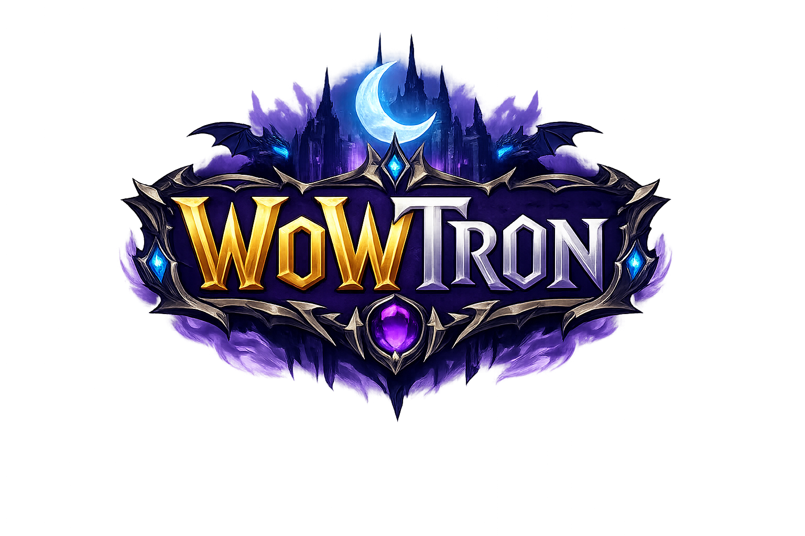

# WoWtron 🎮

The ultimate all-in-one platform for World of Warcraft guild management, raid planning, Mythic+ tracking, and player recruitment.



## Features

- **Guild Management** - Manage your roster, ranks, and settings all in one place
- **Raid Planning** - Schedule raids, track signups, and manage attendance
- **M+ Tracker** - Track Mythic+ scores, weekly affixes, and dungeon progress
- **Log Analysis** - Upload Warcraft Logs and get AI-powered insights with video-editor style timeline
- **Recruitment** - Find the perfect players with smart matching and anti-booster detection
- **Player Cards** - Detailed player profiles with performance metrics

## Tech Stack

- **Framework**: Next.js 16 (App Router)
- **Styling**: Tailwind CSS 4
- **UI Components**: shadcn/ui + Radix UI
- **Icons**: Lucide React
- **Charts**: Recharts
- **Language**: TypeScript

## Getting Started

### Prerequisites

- Node.js 18+ or Bun
- npm, yarn, pnpm, or bun

### Installation

```bash
# Clone the repository
git clone https://github.com/kurashitai/wowtron.git
cd wowtron

# Install dependencies
bun install

# Run development server
bun dev
```

Open [http://localhost:3000](http://localhost:3000) with your browser.

### Build for Production

```bash
bun build
bun start
```

## Project Structure

```
wowtron/
├── public/              # Static assets
│   └── wowtron-logo.png
├── src/
│   ├── app/             # Next.js App Router pages
│   │   ├── page.tsx     # Main application
│   │   ├── layout.tsx   # Root layout
│   │   └── globals.css  # Global styles
│   ├── components/      # React components
│   │   ├── ui/          # shadcn/ui components
│   │   └── log-analysis.tsx  # Log analysis feature
│   ├── lib/             # Utility libraries
│   │   ├── wow-data.ts  # WoW class/rank data
│   │   ├── mock-data.ts # Demo data
│   │   └── combat-logs.ts # Combat log parsing
│   └── hooks/           # React hooks
├── tailwind.config.ts   # Tailwind configuration
└── next.config.ts       # Next.js configuration
```

## Log Analysis Features

The Log Analysis module includes:

- **Video-editor style timeline** with play/pause, speed controls (0.5x-4x), and skip buttons
- **Real-time event log** synced with timeline position
- **DPS/HPS/DTPS graphs** with player selection
- **Boss ability breakdown** with target tracking
- **Comprehensive metrics**: Deaths, interrupts, dispels, buff uptime, consumables
- **Sortable player tables** with rank percentages

## Deployment

### Vercel (Recommended)

1. Push your code to GitHub
2. Import project on [Vercel](https://vercel.com)
3. Vercel will auto-detect Next.js and configure the build

[](https://vercel.com/new/clone?repository-url=https://github.com/kurashitai/wowtron)

## Color Scheme

WoWtron uses a WoW-inspired color palette:

- **Gold**: `#FFD700` - Primary accent
- **Purple**: `#8B5CF6` - Secondary accent  
- **Blue**: `#1E90FF` - Info elements
- **Silver**: `#C0C0C0` - Text and borders

## License

MIT License - feel free to use for your own WoW guild!

---

Made with ❤️ for the WoW community
